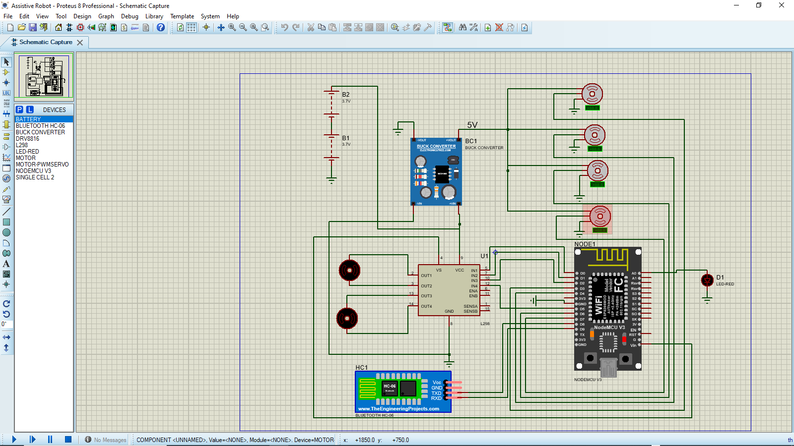
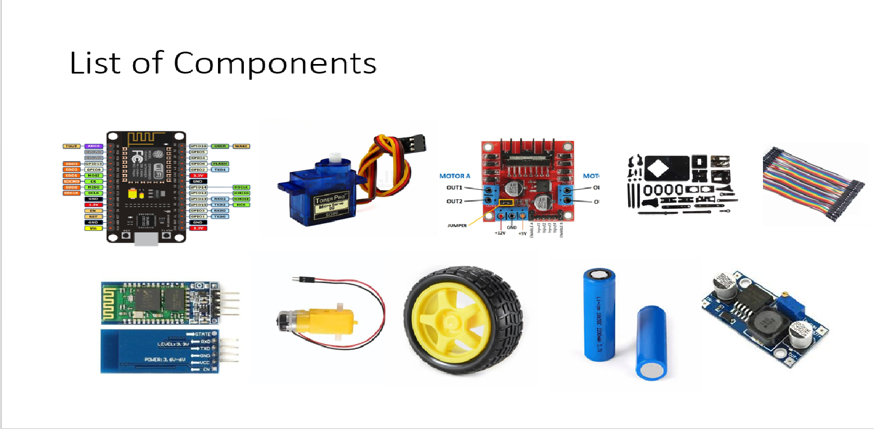

# Assistive Robot Project

A Bluetooth-controlled assistive robot with a 4-DOF robotic arm mounted on a differential-drive mobile base, designed to help users pick up and manipulate objects in their environment.

---

## Overview

The Assistive Robot is a human-robot interactive system that emulates how robots and humans can work together in everyday environments. The robot can navigate a room, position itself near objects, and use its articulated arm to pick them up — all controlled wirelessly via a Bluetooth mobile interface.

This project is built around a NodeMCU V3 (ESP8266) microcontroller, a 4-servo robotic arm, and a dual DC motor drivetrain, communicating over Bluetooth (HC-06).

---

## Features

- 4-DOF Robotic Arm — Base rotation, elbow lift/lower, wrist tilt, and gripper open/close
- Mobile Base — Forward, backward, left, and right differential drive
- Bluetooth Control — Wireless command interface via HC-06 and a custom Android app built with MIT App Inventor
- Dual Battery System — Separate 3.7V Li-ion cells with a buck converter regulating 5V for logic and servos
- Status LED — Visual Bluetooth connection indicator
- Home Position — One-command arm reset to a safe starting position

---

## Hardware Components

| Component | Quantity | Purpose |
|---|---|---|
| NodeMCU V3 (ESP8266) | 1 | Main microcontroller |
| HC-06 Bluetooth Module | 1 | Wireless serial communication |
| L298N Motor Driver | 1 | DC motor control |
| SG90 / MG90S Servo Motors | 4 | Arm joints (base, elbow, wrist, gripper) |
| DC Gear Motors | 2 | Wheel drive |
| Buck Converter | 1 | Steps down battery voltage to 5V |
| 3.7V Li-ion Batteries | 2 | Power supply |
| LED | 1 | Bluetooth status indicator |
| Wheels + Chassis | — | Mobile base frame |

---

## Pin Mapping (NodeMCU V3)

| NodeMCU Pin | Connected To | Role |
|---|---|---|
| D6 | Gripper Servo | PWM signal |
| D7 | Wrist Servo | PWM signal |
| D3 | Elbow Servo | PWM signal |
| D4 | Base Servo | PWM signal |
| D0 | L298N IN1 | Motor A direction |
| D1 | L298N IN2 | Motor A direction |
| D2 | L298N IN3 | Motor B direction |
| D5 | L298N IN4 | Motor B direction |
| D8 | LED | Status indicator |
| RX/TX | HC-06 TXD/RXD | Bluetooth serial |

---

## Circuit Schematic



---

## Component Reference



---

## Repository Structure

```
Assistive-Robot-Project/
├── Assistive_Robot.ino          # Main Arduino sketch
├── AssitiveRobot_Schematics2.png  # Proteus schematic
├── List_Of_Components.png       # Bill of materials
├── Phantom R V6.apk             # Android control app
├── LICENSE
└── README.md
```

---

## Getting Started

### Prerequisites

- [Arduino IDE](https://www.arduino.cc/en/software) (1.8.x or later)
- ESP8266 board package installed in Arduino IDE
- `Servo.h` library (included with Arduino IDE)
- Android device for the custom control app

### Installation

1. Clone the repository
   ```bash
   git clone https://github.com/your-username/Assistive-Robot-Project.git
   cd Assistive-Robot-Project
   ```

2. Install the ESP8266 board package
   - In Arduino IDE, go to File > Preferences
   - Add this URL to "Additional Board Manager URLs":
     ```
     http://arduino.esp8266.com/stable/package_esp8266com_index.json
     ```
   - Go to Tools > Board > Board Manager, search `esp8266`, and install

3. Open the sketch
   - Open `Assistive_Robot.ino` in Arduino IDE

4. Configure the board
   - Board: `NodeMCU 1.0 (ESP-12E Module)`
   - Upload Speed: `115200`
   - Port: Select your COM port

5. Upload the sketch
   - Connect your NodeMCU via USB and click Upload

6. Install the Android app
   - Transfer the `.apk` file to your Android device
   - Enable "Install from unknown sources" in your device settings
   - Install and open the app
   - Pair with the HC-06 Bluetooth module (default PIN: `1234`)

---

## Control Commands

The robot listens for serial commands over Bluetooth. Below is the full command reference.

### Drive Commands

| Command | Action |
|---|---|
| `FWD` | Move forward (continuous) |
| `BWD` | Move backward (continuous) |
| `LFT` | Turn left (continuous) |
| `RGT` | Turn right (continuous) |
| `STP` | Stop motors |
| `FDS` | Move forward (short nudge) |
| `BDS` | Move backward (short nudge) |
| `LTS` | Turn left (short nudge) |
| `RTS` | Turn right (short nudge) |

### Arm Commands

| Command | Action |
|---|---|
| `BL` / `BLS` | Rotate base left / stop |
| `BR` / `BRS` | Rotate base right / stop |
| `HL` / `HLS` | Lift arm (elbow + wrist) / stop |
| `LL` / `LLS` | Lower arm (elbow + wrist) / stop |
| `PUSH` / `PUSHS` | Extend elbow forward / stop |
| `PULL` / `PULLS` | Retract elbow / stop |
| `PK` / `PKS` | Close gripper / stop |
| `PL` / `PLS` | Open gripper / stop |

### System Commands

| Command | Action |
|---|---|
| `ST` | Start / activate robot |
| `H` | Return arm to home position |

> **Note:** The robot must receive the `ST` command before arm and drive commands are accepted. This is a safety feature to prevent accidental movement on startup.

---

## How It Works

### Arm Control

The arm uses 4 servo motors driven by PWM signals from the NodeMCU. Movement is incremental — each loop iteration moves the servo by 1 degree while a command flag is active, giving smooth and controllable motion.

The elbow and wrist are linked during lift/lower operations: as the elbow raises, the wrist compensates to keep the end-effector level. An independent reference angle (`eangleR`) is tracked for push/pull movements that should not affect the wrist coupling.

### Bluetooth Communication

The HC-06 module connects to the NodeMCU's hardware serial port at 9600 baud. Incoming strings are read, trimmed, and converted to uppercase before being matched against the command table.

### Status LED

- Blinking — Bluetooth disconnected, waiting for connection
- Solid on — Bluetooth connected and active

### Power System

Two 3.7V Li-ion cells power the system. A buck converter steps the voltage down to a regulated 5V for the NodeMCU and servos. The L298N motor driver handles the higher current demands of the DC motors separately.

---

## Initial (Home) Position

| Joint | Angle |
|---|---|
| Base | 178 degrees |
| Elbow | 45 degrees |
| Wrist | 110 degrees |
| Gripper | 70 degrees (open) |

---

## Take Notes

- The `H` (home) command is currently commented out in the sketch — the `home()` and `autoPick()` functions exist but are not triggered via Bluetooth
- All arm and drive commands require the `ST` command to have been sent first
- No obstacle detection — navigation is fully manual
- Bluetooth range is limited to approximately 10 metres (line of sight)

---

## Future Improvements

- Enable the `H` home command and implement the `autoPick()` auto-grab sequence
- Add an ultrasonic sensor for obstacle avoidance
- Implement variable speed control via PWM on the L298N enable pins
- Add position feedback using potentiometers or encoders
- Explore WiFi control mode using the ESP8266's built-in WiFi capabilities

---

## License

This project is licensed under the MIT License. See the [LICENSE](LICENSE) file for details.

---

## Acknowledgements

- Schematic designed with [Proteus 8 Professional](https://www.labcenter.com/)
- Control interface: Custom Android app designed and built with [MIT App Inventor](https://appinventor.mit.edu/)
- Built on the [ESP8266 Arduino Core](https://github.com/esp8266/Arduino)
